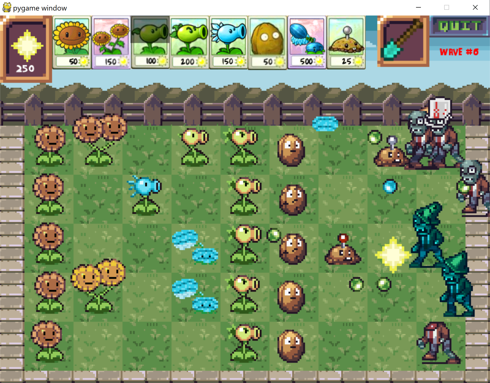
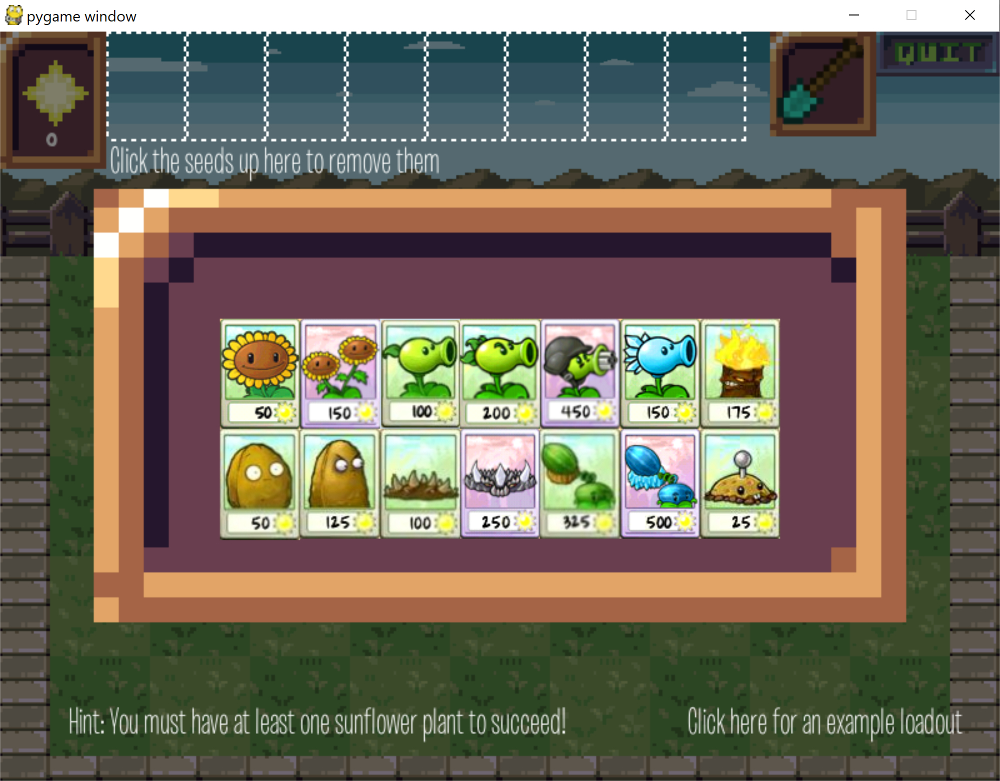

# PlantsVSZombiesParody
A recreation of the popular game, Plants VS Zombies, with endless waves progressing in difficulty.
Please note that I claim ownership of all items in this project, except for the music, and most of the sprites. For those two categories of items, all rights are reserved by their respective owners.
Please have fun playing this game, but please refrain from sharing it other than via this github repo.

# Introduction

Welcome to Matthew Pechen-Berg's Plants vs. Zombies!

The goal of the game is to place down plants on your lawn to defend against an infinite number of waves of zombies.
In order to do this, you control a resource called 'sun' thatyou must produce from sunflowers or receive randomly from the sky.
The game ends when a zombie hits the left side of the screen.
You can also use the shovel tool to dig up plants you no longer want.
But first, you must create your arsenal of plants.

# Requirements

It requires a version of Python 2 and Pygame.

# Controls

* LEFT CLICK: Select, deselect, and place plants, collect suns,select and deselect the shovel, add and remove plants to your arsenal.
* RIGHT CLICK: Deselect plants or the shovel
* THE 's' KEY: Toggle on/off the shovel
* NUMBERS 1-8: Select your plant #1-8

